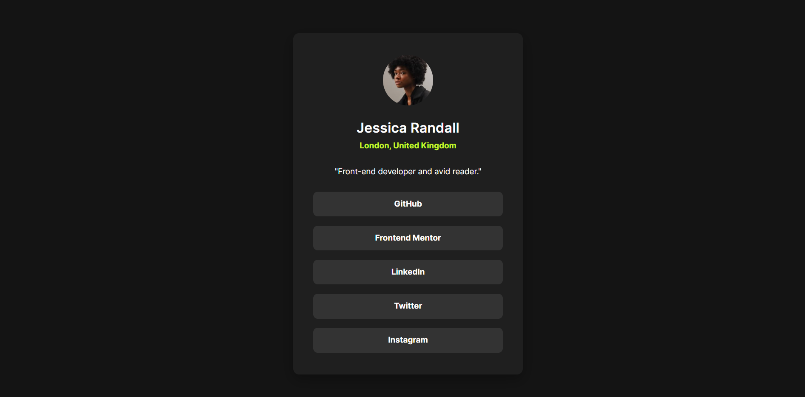

# Frontend Mentor - Social links profile solution

This is a solution to the [Social links profile challenge on Frontend Mentor](https://www.frontendmentor.io/challenges/social-links-profile-UG32l9m6dQ). Frontend Mentor challenges help you improve your coding skills by building realistic projects. 

## Table of contents

- [Overview](#overview)
  - [The challenge](#the-challenge)
  - [Screenshot](#screenshot)
  - [Links](#links)
- [My process](#my-process)
  - [Built with](#built-with)
  - [What I learned](#what-i-learned)
  - [Continued development](#continued-development)
  - [Useful resources](#useful-resources)
- [Author](#author)
- [Acknowledgments](#acknowledgments)

## Overview

### The challenge

Users should be able to:

- See hover and focus states for all interactive elements on the page
 - View the component layout optimally on mobile and desktop
 - Navigate links using the keyboard with visible focus states

### Screenshot




.png)


### Links

- Solution URL: [Social links profile solution](https://github.com/ichane31/Social-links-profile)
- Live Site URL: [Social links profile](https://social-links-profile-kappa-ruby.vercel.app/)

## My process

### Built with

- Semantic HTML5 markup
- CSS custom properties
- Flexbox
- CSS Grid
- Mobile-first workflow
 - Local fonts with `@font-face` and `font-display: swap`
 - Accessibility-first considerations (`:focus-visible`, color contrast, reduced motion)

### What I learned

While building this component I focused on clean structure, accessibility, and subtle interaction polish.

```html
<!-- Clear and accessible structure -->
<main>
  <div class="container">
    
    <div class="profile-info">
      <h1>Jessica Randall</h1>
      <p class="location">London, United Kingdom</p>
    </div>
    <p class="quote">"Front-end developer and avid reader."</p>
    <ul class="social-links"> ... </ul>
  </div>
  
  <!-- Landmarks and semantics kept simple for this small component -->
</main>
```

```css
/* Local fonts + performance */
@font-face {
  font-family: 'Inter-Regular';
  src: url('./assets/fonts/static/Inter-Regular.ttf') format('truetype');
  font-style: normal;
  font-display: swap;
}

/* Keyboard visibility and motion preferences */
.social-links li a:focus-visible {
  outline: 2px solid var(--green);
  outline-offset: 2px;
}

@media (prefers-reduced-motion: reduce) {
  * { transition: none !important; }
}

/* Scoped list styles to avoid global leakage */
.social-links { display: flex; flex-direction: column; gap: 14px; }
```

Key takeaways:
- Implementing local fonts with `font-display: swap` to improve perceived performance.
- Providing clear focus states using `:focus-visible` for better keyboard accessibility.
- Respecting user motion preferences with `prefers-reduced-motion`.
- Scoping list/button styles to `.social-links` to prevent unintended global effects.

### Continued development

- Deepen accessibility practices (ARIA where appropriate, improved focus rings, tab order audits).
- Explore CSS container queries to further refine responsiveness.
- Automate checks with Lighthouse/axe for performance and a11y regressions.
- Consider theming support (light/dark) using CSS custom properties.

### Useful resources

- [MDN: @font-face](https://developer.mozilla.org/en-US/docs/Web/CSS/@font-face)
- [MDN: :focus-visible](https://developer.mozilla.org/en-US/docs/Web/CSS/:focus-visible)
- [MDN: prefers-reduced-motion](https://developer.mozilla.org/en-US/docs/Web/CSS/@media/prefers-reduced-motion)
- [A11y Project: Keyboard accessibility](https://www.a11yproject.com/posts/operable/#keyboard)

## Author

- Name - [ASSOUMA Roukéya](ASSOUMA-Roukeya)
- Frontend Mentor - [@ichane31](https://www.frontendmentor.io/profile/ichane31)

## Acknowledgments

Thanks to the Frontend Mentor community for helpful discussions and inspiration on accessible UI patterns.
